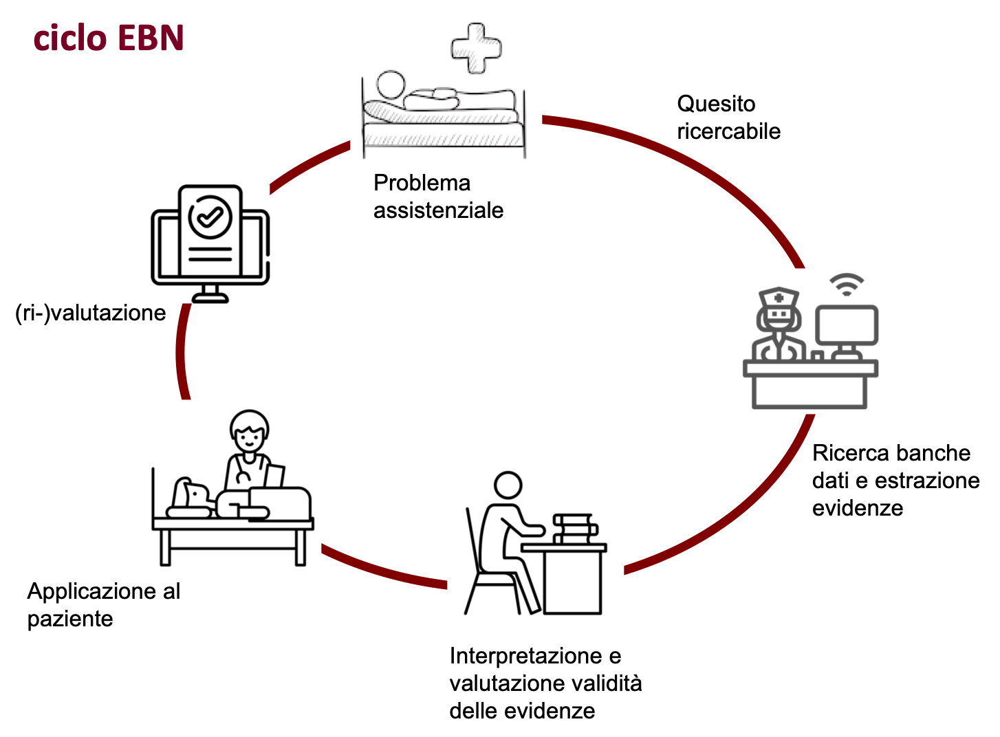
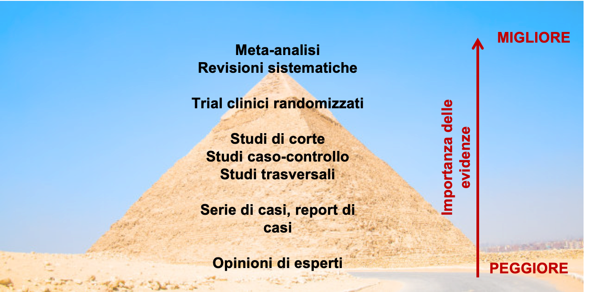

---
output:
  html_document: default
  pdf_document: default
---
# Evidence Based Nursing: la pratica clinica basata sulle prove di efficacia

L'assistenza infermieristica indica l'attività terapeutica, palliativa, riabilitativa, educativa e preventiva rivolta all'individuo, alla comunità o alla popolazione. Sono quindi tutti quegli interventi svolti dall'infermiere su soggetti sani o malati, al fine di recuperare uno stato di salute adeguato o prevenire l'insorgenza delle malattie.
  
  
La scelta dell'intervento assistenziale proposto al paziente deve essere basata su criteri di _appropriatezza_. Il trattamento più appropriato è quello che porta benefici al paziente creando il minor numero di effetti negativi (o effetti avversi). Le prove di efficacia e sicurezza stanno alla base delle linee guida cliniche e dei protocolli diagnostico-terapeutici che sono condivisi dal personale sanitario responsabile dell'assistenza. 
  
  
L'esito dello stesso intervento assistenziale in una popolazione di pazienti non è però omogeneo per tutta una serie di fattori tra cui la variabilità individuale da paziente a paziente e le circostanze cliniche che variano da reparto a reparto.
  
  
**Come determiniamo che l’intervento scelto per un pz specifico sia il più appropriato?** Le opzioni disponibili nel passato erano limitate a quanto imparato durante il corso di formazione o alla routine dell’unità operativa ("si e' sempre fatto cosi'"). La rapida obsolescenza delle tecniche e conoscenze infermieristiche in molti settori dell'assistenza e l'assenza di un sistema per valutare l'appropriatezza delle scelte assistenziali rende pero' questo approccio non ottimale ed inaccettabile nella moderna pratica clinica.  
  
  
Dall’inizio degli anni ’90 si diffonde in tutti i settori della medicina un nuovo paradigma che sostiene la _necessità_ di basare le decisioni cliniche e assistenziali sulle **evidences** provenienti dalla ricerca clinica. Nasce il movimento _Evidence Based Medicine_ che è definito come _l’uso coscienzioso ed esplicito nella pratica clinica delle migliori conoscenze possibili al momento del processo decisionale riguardante la cura dei singoli pazienti_ (Sackett et al., 1996). 
  
  
Questo approccio si diffonde alle professioni sanitarie e nelle scienze infermieristiche prendendo il nome di **Evidence Based Nursing (EBN)**, in italiano _infermieristica basata sulle prove di efficacia_.
  
  
## Definizione di EBN

L’infermieristica basata sulle prove di efficacia è il processo attraverso il quale gli infermieri assumono decisioni cliniche relative all’assistenza utilizzando i risultati delle le migliori ricerche disponibili, la loro esperienza clinica, le preferenze del paziente e tenendo conto del contesto di risorse disponibili. (Di Censo et al., 1998)

>Si noti come il termine inglese _evidence_ ("prova", "dimostrazione") abbia in italiano proprio il significato opposto (evidente: "chiaro", "esplicito", non confutabile"). Per questo motivo è **errato** riferirsi all'EBN come "Infermieristica basata sulle evidenze" perchè in EBN non è evidenza ciò che è esplicito ma ciò che è dimostrato. In italiano EBN si traduce come Infermieristica basata su prove di efficacia dove per **efficacia** si intende _la capacità o il potere del trattamento infermieristico di produrre l’effetto desiderato_.
  
  
Questa definizione e' conforme al codice deontologico dell’infermiere che negli articoli 11 e 12 recita: 
  
  
Art. 11:  

_“L’infermiere fonda il proprio operato su conoscenze validate e aggiorna saperi e competenze attraverso la formazione permanente, la riflessione critica, sull’esperienza e la ricerca”_ 
  
  
Art. 12:  

_“L’infermiere riconosce il valore della ricerca, della sperimentazione clinica e assistenziale per l’evoluzione delle conoscenze e per i benefici sull’assistito.”_
  
  
Il modello concettuale EBN prevede dunque l’integrazione della migliore evidenza prodotta dalla ricerca sia con la competenza e l’esperienza clinica dell'infermiere sia con le preferenze e i valori del paziente {figura mod concettuale EBN}.

{width=80%}
  
  
Gli elementi che vanno considerati sono:
  
  
**Stato e circostanze cliniche**. Lo stato e le circostanze cliniche (es. gravità della malattia, instabilità clinica, comorbidità) influenzano l'intensità assistenziale (o setting assistenziale). L’aspetto essenziale delle decisioni cliniche basate sull’evidenza è quello di effettuare azioni assistenziali appropriate alle specifiche circostanze del paziente. 
  
  
**Preferenze ed azioni del paziente**. Le preferenze e le azioni del paziente si riferiscono alle aspettative che il paziente ha e che vanno considerate nella decisione clinica. Si noti come le azioni del paziente possono essere differenti dalle sue preferenze e/o desideri. Per esempio, un paziente può accettare "a parole" di perdere peso, smettere di fumare o prendere la terapia prescritta ma poi puo' non riuscire "nei fatti" a raggiugere questi obiettivi. 
  
  
**Risorse disponibili**. Si riferiscono alle risorse utilizzabili per erogare l’assistenza infermieristica in un contesto organizzativo specifico in termini di dispositivi e presidi medici (qualità struttura), qualità del processo di assistenza, abilità e numerosità del personale, tempo a disposizione ecc. 
  
  
**Evidenze dalla ricerca**. Nel nursing, come in tutte le scienze sanitarie, la migliore evidenza prodotta dalla ricerca si riferisce a studi epidemiologici che siano metodologicamente corretti e clinicamente rilevanti. Le linee guida e i protocolli diagnostico-terapeutici sono basati su prove (in inglese "evidences") di efficacia e sicurezza. Ne segue che le regole formali per interpretare i risultati della ricerca clinica devono essere insegnate come parte della regolare formazione infermieristica. Identificare le migliori evidenze scientifiche richiede rudimentali nozioni di epidemiologia.
  
  
**Esperienza personale** 
L’esperienza clinica è il mezzo per integrare le quattro componenti sopra citate. Si riferisce all’abilità dell’infermiere di identificare i bisogni assistenziali del pz, prevedere i rischi durante la degenza /convalescenza, saper agire/affrontare gli interventi assistenziali più appropriati, saper comunicare le informazioni ai pazienti e ai loro familiari, saper fornire loro un ambiente che sia confortevole e di supporto al paziente.
  
  
### Benefici dell'approccio "evidence based"
Praticare EBN è da molti ritenuto necessario per erogare la migliore assistenza possibile e quindi rispettare l’obbligo degli infermieri verso la società. Le implicazioni del modello EBN sopra descritto sono che l’intuizione e l’esperienza clinica *non sistematica* del professionista e la mera conoscenza delle tecniche non siano sufficienti a garantire standard assistenziali qualitativamente elevati. 
  
  
Per esempio, Heater et al. (1988) hanno riassunto 84 studi condotti da infermieri che comprendevano 4.146 pazienti. I pazienti assistiti da professionisti che praticavano EBN avevano miglioramenti considerevoli in comportamenti, conoscenze, parametri fisiologici e psicosociali rispetto ai pazienti assistiti in maniera tradizionale.
  
  
Cui et al. (2018) hanno riassunto 9 studi condotti su >1000 infermieri. Gli infermieri che hanno studiato EBN hanno una maggiore attitudine al pensiero critico e all’applicazione dell’assistenza più appropriata.
  
  
Alcune conseguenze della non applicazione dei principi EBN sono la erogazione di prestazioni sanitarie non ottimali, l'esposizione dei pz a rischi non necessari, la determinazione di costi non giustificati, la difformità nella pratica infermieristica tra reparti ed ospedali oltre alla scarsa crescita professionale.
  
  
### Ostacoli e limiti all'applicazione dell’EBN 
Uno degli ostacoli allo sviluppo dell’EBN in Italia è rappresentato dalla resistenza del personale infermieristico al cambiamento: conservazione della tradizionale organizzazione per compiti e consuetudine alle routine. L’assenza di sufficiente razionalita' organizzativa e di adeguate motivazioni scientifiche a supporto delle attività̀ assistenziali determinano spreco di risorse professionali e bassa efficacia complessiva dell’assistenza. Questo si associa spesso a demotivazione e all'abbassamento dei livelli di professionalita' del personale infermieristico.
  
  
Un altro problema è costituito dall'assenza di risultati o risultati contrastanti della ricerca per alcuni quesiti clinici ("zone grigie" della letteratura). In molti settori dell’assistenza, come più̀ in generale della medicina, vi sono numerose ed ampie zone grigie dove non sono reperibili evidenze sull’efficacia di un intervento assistenziale e/o delle sue alternative.
  
  
Altri ostacoli all'implementazione della EBN sono l'incremento continuo di nuove conoscenze che rende estremamente difficile per qualsiasi professionista mantenersi aggiornato e la scarsa trasferibilità dei risultati di alcune ricerche alla pratica clinica. Infine, la formazione universitaria fornisce solo in parte competenze specifiche per la ricerca e l’approccio critico alla letteratura sanitaria. A questo si sommano una scarsa conoscenza della lingua inglese, una limitata diffusione dei moderni strumenti d’informazione ed informatici nelle nostre strutture assistenziali. 
  
  
## Esercizio

1) Descrivi con parole tue le 5 componenti del modello EBN 

--	Stato e circostanze cliniche 

--	Preferenze ed azioni del paziente 

--	Risorse disponibili 

--	Evidenze della ricerca 

--	Esperienza personale 
	
2) Quali sono le conseguenze di non seguire la pratica clinica basata sulle prove di efficacia? 
  
  
3) Descrivi alcune dei limiti all’applicazione della EBN in Italia 

## Le fasi della infermieristica basata sulle evidenze 

Operativamente si possono identificare 5 fasi:

1) Identificare i problemi o i dubbi che derivano dalla pratica quotidiana o dall’assistenza ad un specifico paziente e tradurre queste incertezze in quesiti focalizzati e ricercabili (“quesito” o “dubbio" assistenziale) 
  
  
2) ricercare nella banche dati con apposite strategie gli studi epidemiologici pubblicati che, con disegni appropriati, aiutano a rispondere al quesito 
  
  
3) interpretare ed analizzare criticamente gli studi raccolti 
  
  
4) adeguare la pratica clinica alle indicazioni individuate 
  
  
5) rivalutare periodicamente l'efficacia
  
  
**Implicazioni**

Le implicazioni di questo modello di assistenza al paziente sono:
  
  
- l’infermiere e’ proattivo nell’identificare i bisogni assistenziali dei pz che non sono soddisfatti efficacemente;
  
  
- a partire dal bisogno del pz, e’ in grado di formulare un quesito ricercabile nelle banche dati e condurre la ricerca (es. su PubMed);
  
  
- l'infermiere conosce la struttura degli studi epidemiologici ed e’ in grado di valutarli ed ottenere una risposta al quesito;
  
  
- applica il risultato nell’assistenza al pz;
  
  
- rivaluta periodicamente l'appropriatezza dell'intervento.
  
  

## Problema assistenziale e quesito di ricerca
La prima fase del ciclo EBN riguarda l'individuazione del problema relativo all'assistenza e la sua trasformazione in un quesito di ricerca che possa essere utilizzato in una banca dati. Il problema assistenziale sono le domande che l’infermiere si pone ogni volta che visita un paziente e che individuano le informazioni di cui ha bisogno per prendere la migliore decisione in ambito assistenziale. Quindi tutto nasce dai bisogni/richieste assistenziali del paziente che rimangono ancora irrisolti e che possono essere inerenti la diagnosi, il trattamento (terapia), la prognosi, l'eziologia o la prevenzione di una certa condizione medica.
  
  
**Formulazione ed importanza del quesito di ricerca**
Il quesito di ricerca è fondamentale per il processo EBN. Esso deriva dal problema assistenziale che, a sua volta, origina dall'osservazione del paziente. “Finché non si è in grado di formulare quesiti a cui è possibile rispondere, si è destinati a sprecare molto del limitato tempo dedicato alla ricerca ed alla consultazione della letteratura disponibile con la conseguenza di rimanere non solo frustrati, ma di vedere diminuire la propria competenza clinica” (Chiari et al., 2011). 
  
  
**Perchè è importante chiarire bene il quesito di ricerca?** Perchè dal quesito vengono estratte le parole chiave che useremo nella interrogazione della banca dati. Dalla chiara espressione del quesito di ricerca possiamo definire i criteri di inclusione o di esclusione, ovvero a quali pazienti possono essere applicati i risultati della ricerca. La tipologia del quesito indica anche quale tipo di studio dobbiamo cercare.
  
  
Un buon quesito di ricerca risulta solitamente costituito dalle seguenti componenti:  
  
  
- Chiara definizione delle caratteristiche del soggetto da assistere (popolazione) 
  
  
- Tipo di azione che si intende attuare nei confronti del pz o fattore di rischio/prognostico di interesse (intervento)
  
  
- Intervento o esposizione di confronto (confronto)
  
  
- Risultati che si vogliono conseguire o eventi che si vogliono evitare (esito) 
  
  
>Per esempio: Come posso alleviare (questo particolare) dolore di (questo particolare) paziente in questa (particolare) fase della degenza? 
Che tipo di comportamento preventivo devo consigliare a (questo particolare) paziente per evitare ricadute (in questa particolare fase della convalescenza) di questa (particolare) malattia? 
Quale fattore di rischio a contribuito a causare la malattia di questo particolare paziente?
  
  
**Quesiti di background** Riguardano gli aspetti generali di una patologia, intervento, situazione clinica, ecc. e riflettono la necessità di arricchimento/ aggiornamento culturale e di conoscenza generale. 
  
  
>Per esempio: quali tipi di complicanze possono manifestarsi nei portatori di cateteri vescicali? Quali tipi di medicazioni usare per i portatori di CVC? Cosa si può fare per ridurre il rischio di errori nella somministrazione di farmaci?
  
  
**Quesiti di foreground (clinici)** I quesiti di foreground (o clinici) riguardano informazioni e conoscenze specifiche circa la gestione di un particolare paziente affetto da una determinata malattia o riguardano una specifica situazione. 
  
  
>Ad esempio: In un paziente con ictus è meglio posizionare i liquidi sull’arto plegico o su quello non plegico? Nel paziente anziano, quanto il rumore e la vibrazione determinata dal materasso antidecubito incide sul sonno e sul livello di stress? Nel paziente con ulcere cutanee infette, la terapia antibiotica sistemica è più efficace della terapia antibiotica topica?
  
## Il metodo PICO

Il “dubbio” assistenziale è di solito formulato in maniera discorsiva o narrativa e deve essere “trasformato” per poter diventare un quesito a cui è possibile dare una risposta. Il metodo **PICO** permette contestualizzare il quesito e di trasformare il quesito dalla forma narrattiva in una "stringa" di ricerca da inserire in una banca dati. 

**P: Patient**. Descrivi il gruppo di pazienti o il problema clinico oggetto della ricerca. Come descriverei un gruppo di pazienti (popolazione) simile al mio?  Considerare: eta’, sesso, patologia, instabilita’ clinica, stadiazione della malattia, storia personale e familiare, contesto socio-economico, storia di patologie pregresse ecc.

**I: Intervention**. Quale intervento sto prendendo in considerazione? Essere specifici. Puo' essere un trattamento o un intervento terapeutico sperimentale,  nuova scala diagnostica, possesso di fattore eziologico/prognostico,  una esposizione ad un fattore nocivo di origine ambientale ecc.

**C: Comparison**. Quale è l’alternativa da confrontare con l’intervento? Puo' essere nulla o piu' spesso un trattamento di controllo o un intervento standard, test diagnostico standard, assenza fattore eziologico/prognostico, la non esposizione ad un fattore nocivo di origine ambientale ecc. 
 
**O: Outcome**. L'esito o risultato clinico a cui sono interessato. Quale effetto osservo in termini di esiti clinicamente rilevanti cone per es. la morte, guarigione, sopravvivenza, infezione, ecc.

### Tipologia quesito / domanda

Una classificazione molto utile riguarda la tipologia del quesito di ricerca. I quesiti di ricerca possono riguardare il trattamento, l'eziologia, la prognosi o la diagnosi di una patologia.

I quesiti di **Trattamento (terapia)** riguardano domande sull' _efficacia_ degli interventi su pazienti affetti da uno o piu' patologie come per esempio valutazioni di efficacia di una terapia farmacologica o di una procedura assistenziale. Sono i quesiti piu' comuni nella pratica infermieristica.

I quesiti **Eziologici** riguardano domande sulle _cause_ dell'insorgenza di una condizione patologica. Di solito viene formulato un quesito eziologico quando si vogliono indagare i fattori di rischio di una certa patologia. Per esempio potremmo essere interessati a identificare le caratteristiche del paziente (come gli stili di vita, l'eta', le comorbidita' ecc.) piu' frequentemente associate con un alto rischio di infarto del miocardio. Sono spesso quesiti di interesse per l'infermiere che presta servizio presso i presidi territoriali (distretto).

I quesiti di **Prognosi** riguardano domande sull' _evoluzione_ di una patologia nei pz che ne sono gia' affetti. Si tenta quindi di identificare quei fattori ("fattori prognostici") che sono associati con una migliore o peggiore prognosi. Per esempio potremmo essere interessati ad individuare i fattori (come l'eta', le comorbidita' ecc.) associate con un recupero funzionale piu' lento nei pazienti che hanno subito un infarto del miocardio. Sono quesiti comuni per l'infermiere ospedaliero. 

I quesiti di **Diagnosi** riguardano domande sull'efficacia degli strumenti o di procedure diagnostiche. Per esempio domande concernenti l'accuratezza della valutazione iniziale o le diagnosi (identificazione dei problemi del paziente) ed il confronto tra diversi sistemi per ottenere una certa diagnosi infermieristica. 
  
  
Tipo di quesito | Significato | Esempio
|:---|:---|---:|
Trattamento | Efficacia di un intervento | E' il trattamento X piu' efficace del trattamento Y?
Eziologici | Eziologia di una condizione | E' il diabete un fattore di rischio per l'infarto del miocardio?
Prognostici | Evoluzione di una condizione | Nel paziente ricoverato per infarto del miocardio, e' il diabete collegato con una degenza piu' lunga?
Diagnosi | Accuratezza diagnostica | E' una certa diagnosi infermieristica accurata?
  

### Esempi

**Quesito di trattamento**  
  
  
Siete in servizio presso il reparto di pediatria. Un collega vi chiede se un bambino di 8 anni che deve essere sottoposto a sutura di una ferita lacero-contusa, l'applicazione di pomata anestetica sia meno dolorosa della somministrazione di lidocaina sottocutanea per l'analgesia (livello di dolore percepito). 

-- Paziente: Pediatrico con ferita lacero-contusa

-- Intervento: Trattamento con pomata anestetica

-- Confronto: Trattamento con lidocaina sottocutanea

-- Outcome: livello dolore percepito
  
   
**Quesito eziologico**
  
  
Sei un coordinatore di un reparto di medicina generale. Un pz di 50 anni ex fumatore e sovrapeso ricoverato per infarto miocardio vi chiede se praticare uno sport come la corsa a livello amatoriale possa essere stata la causa della sua malattia.Prima di rispondere decidi di svolgere la ricerca nelle banche dati. 
  
   
-- Paziente: individuo ex-fumatore, sovrapeso

-- Intervento: Pratica sport aerobico

-- Confronto: Non pratica sport

-- Outcome: infarto
  
  
  
**Quesito prognostico**
  
  
Sei un coordinatore di un reparto di medicina generale. Un pz di 50 anni ex fumatore e sovrapeso ricoverato per infarto miocardio vi chiede se praticare uno sport come la corsa a livello amatoriale possa provocare un recidive/ricadute della sua malattia. Prima di rispondere decidi di svolgere la ricerca nelle banche dati. 

-- Paziente: pz exfumatore, sovrapeso, infartuato

-- Intervento: Pratica sport aerobico 

-- Confronto: Non pratica sport

-- Outcome: recidive  
  
  
**Quesito diagnostico**  
  
  
Un coordinatore di un reparto di geriatria e ti chiedono un consiglio relativamente alla migliore scala per diagnosticare il rischio di caduta nei pz affetti da demenza grave che entrano in reparto. Individui due scale: la scala di Conley e la scala Stratify. Ti chiedi quale sia la piu’ accurata per pz di questo tipo. 
  
-- Paziente: pz geriatrico con demenza grave   

-- Intervento: Scala Conley 

-- Confronto: Scala Stratify   

-- Outcome: cadute in reparto
  
  

## Ricerca delle evidenze
La ricerca delle evidenze e' il secondo step nel ciclo EBN. Per prima cosa chiariamo cosa sono le "evidenze" e dove le possiamo reperire in maniera efficiente e poi facciamo un esempio di interrogazione della banca dati PubMed.
  
  

**Evidenze = prove scientifiche**. Come detto, le “prove di efficacia” sono delle dimostrazioni scientifiche che una determinata azione assistenziale (trattamento, diagnosi ecc.) funziona per lo scopo per la quale la facciamo. In altri termini sono i risultati di ricerche di buona qualita’ che sono state pubblicati su riviste specializzate dopo essere stati sottoposti al processo di revisione tra pari (peer review). Ovvero sottoposte alla verifica preventiva della ricerca di professionisti/esperti del settore specifico. Una volta pubblicato, le conclusioni e le metodologie di un lavoro possono essere verificate da altri ricercatori su altri pazienti.
  
  
**Cosa viene archiviato in forma ricercabile?** Tutti gli abstract delle ricerche pubblicate su riviste internazionali vengono indicizzate nelle banche banche dati. Gli abstract riflettono la struttura dell'intero articolo scientifico che di solito e' composto dalle seguenti sezioni: 

-- Introduction = motivazioni per affrontare quel particolare quesito di ricerca 

-- Methods = Come è stata svolta la ricerca e in che modo hanno analizzato i risultati 

-- Results = Cosa è stato provato/scoperto 

-- Discussion = Cosa gli autori pensano possano significare i risultati ottenuti 

-- Conclusions = Quali sono le implicazioni, il significato per l'assistenza infermieristica
  
  
**Quale studio è utile per EBN?** Al giorno d'oggi c'è sovracarico di informazione disponibile: esistono >50 milioni di pubblicazioni biomediche disponibili in database, viene aggiunta una pubblicazione  ogni 30 secondi. Per es. con una ricerca su PubMed su un problema clinico comune si ottengono facilmente migliaglia di titoli ed abstract di pubblicazioni tra le quali e' difficile orientarsi. Tuttavia, le informazioni contenute nel 70 - 80% di questi articoli sono spesso inutili perchè derivanti da studi costruiti con metodologie scorrette o perchè irrilevanti dal punto di vista clinico o perchè obsoleti.
  
  
Perchè sia rilevante per EBN uno studio deve: 
  
  
1) Essere rilevante: dare indicazioni utili per la propria pratica clinica. Quindi deve dare un informazione orientata al paziente ovvero riguardare esiti clinicamente significativi (eventi maggiori, mortalità, qualità di vita). 
  
  
2) Essere valido: devono essere verificate la validità interna (assenza di errori casuali e sistematici) e la validità esterna (trasferibilita’ dei risultati ad altri contesti assistenziali)
  
  
3) L’informazione deve essere reperibile in maniera efficiente in termini di tempo, costi, energie mentali
  
  
## Ricerca nelle banche dati

L'infomazione relativa alle ricerche pubblicate (e a volte ancora non pubblicate, cioè in forma di pre-prints) può essere ricercata con i comuni motori di ricerca o nelle apposite banche dati biomediche. 
  
  
**Motori di ricerca (google)**. I contenuti di una ricerca che vengono restituiti da google non devono adeguarsi ad alcuno standard qualitativo e l’informazione non è organizzata o stabile (cioe' puo' scomparire). I risultati di una ricerca su google e' una lista di link a pagine web e sono il prodotto di algoritmi automatici non controllati dall'utente. Non consentono ricerche complesse o combinate e hanno poche possibilita’ di applicare limiti e/o filtri. Tuttavia sono semplici da utilizzare e consentono di recuperare tutte le informazioni non indicizzate nelle banche dati (come per es. la letteratura grigia come i rapporti tecnici).
  
  
**Banche dati**. Le banche dati come per es. Pubmed, Scopus, Chinal sono dei cataloghi che contengono i riferimenti bibliografici di ogni ricerca pubblicata.I contenuti sono indicizzati da specialisti del settore e, come detto, sono stati precedentemente sottoposti a peer review. L’informazione contenuta è organizzata e stabile nel tempo, consentono la ricerca per parole chiave in molteplici campi (per es. nel titolo, nell'abstract, negli autori ecc.), consentono di visualizzare la cronologia delle ricerche effettuate, di combinare le ricerche tra loro, di salvare le ricerche, di impostare degli avvisi sulle novità concernenti le ricerche effettuate ed e’ possibile raffinare la ricerca tramite filtri e limiti dettagliati e peculiari.
  
  
**Cosa devo valutare?** Dalla lettura dell'abstract in genere si capisce se l'articolo e' rilevante per rispondere ad un determinato quesito di ricerca. Se riteniamo, dopo la lettura dell'abstract, che un articolo sia rilevante passeremo al reperimento e successiva valutazione critica dei risultati previa lettura dell'intera pubblicazione. Come vedremo nei capitolo seguenti, la valutazione critica di una ricerca prevede l'analisi dei metodi e dei risultati, ovvero le sezioni Methods e Results dell'articolo.
  
  
### PubMed 
La banca dati PubMed [(https://www.ncbi.nlm.nih.gov/pubmed/)] è la più utilizzata in campo biomedico. Una volta definito il quesito di ricerca in formato PICO, posso inserire le varie parole chiave, combinarle con opportuni _operatori booleani_ e cercarle nei campi indicizzati (es. tutto l’abstract, il titolo...) degli abstract che sono stati archiviati nella banca dati. 
  
  
**Operatori booleani** si tratta di operatori logici che possono essere utilizzati per stabilire una particolare relazione tra i termini da ricercare; quelli utilizzabili in PubMed sono i tre più noti: `AND`, `OR`, `NOT`, da scriversi in maiuscolo tra i due termini posti in relazione.
  
  
-- `AND` recupera documenti che contengono entrambi i termini;

-- `OR` recupera documenti che contengono almeno uno dei due termini, oppure entrambi;

-- `NOT` recupera documenti che contengono solo il primo dei due termini, escludendo il secondo o i documenti in cui ci sia compresenza dei due.
  
  
**Esempi:**
  
  
-- `Pressure ulcers AND geriatric`: i documenti contengono contemporaneamente i termini `Pressure ulcers` e `geriatric`

-- `Pressure ulcers OR geriatric`: i documenti contengono o `Pressure ulcers` o `geriatric`, oppure entrambi;

-- `Pressure ulcers NOT geriatric`: i documenti contengono solo `Pressure ulcers`, escludendo quelli in cui è presente anche `geriatric`.
  
  
La ricerca in cui i termini sono combinati con l'operatore `OR` produce un maggior numero di risultati rispetto alla stessa ricerca impostata con `NOT`. L'operatore `AND`, invece, restringe ulteriormente la ricerca.
  
  
**Uso di parentesi**. Nelle ricerche più articolate, in cui vengono combinati diversi termini, è possibile utilizzare le parentesi per stabilire un ordine di priorità nella lettura della stringa di ricerca: in assenza di parentesi, infatti, il sistema legge sequenzialmente, da sinistra a destra. Le parentesi `( )` indicano l’ordine con cui i termini vengono ricercati: quelli tra parentesi sono analizzati per primi. Importanti per estrarre i termini secondo l’eventuale condizione booleana. Es. volete ricercare come assistere un pz con infezioni specifiche delle piaghe da decubito, una stringa con `nursing AND bedsores OR infections` avra’ come esito: `nursing AND bedsores + infections`. Per avere il risultato voluto `nursing AND bedsores + nursing AND infections` si possono utilizzare le parentesi in questo modo: `nursing AND (bedsores OR infections)` 

**Caratteri jolly**. Le `“ ”` (virgolette) permettono di ricercare due o più termini nell’ordine preciso con il quale vengono scritte. Es: `“pressure ulcers”` Il motore cerchera’ nei vari campi testuali esattamente le due parole e nel preciso ordine in cui sono state scritte. Se non fossero presenti le virgolette l’ordine non sarebbe considerato, sarebbe calcolata la sola presenza delle 2 parole nel testo (`pressure OR ulcers`). 
  
  
L’asterisco `*` Permette di ricercare all’interno dei campi tutte le parole con una stessa radice. Es. `ulcer*` Il motore cerchera’ nei vari campi testuali tutte quelle parole che cominciano con ulcer come ulcer, ulcers, ulceration...
  
  
**Uso dei termini MeSH**. Nel menu a tendina e' possibile selezionare l'archivio "MeSH". Si tratta di un "dizionario dei sinonimi" molto utile. Per es. selezionando il termine MeSH `“pressure ulcers”`,  comprendiamo nella ricerca tutti gli altri sinonimi di ulcere da pressione (Bedsores, Decubitus Ulcers) senza che li dobbiamo inserire manualmente nei campi di ricerca. 
  
  
**Limiti**. Sulla homepage di PubMed, nel menu sulla sinistra, è possibile utilizzare lo strumento `"Limits"` per delimitare la ricerca. Diversi menu a tendina e box selezionabili permettono di aggiungere termini in uno specifico campo (autori, titoli di periodici) e di scegliere varie opzioni di restituizone dei records come i soli record provvisti di abstract e/o di full-text, la data di pubblicazione degli articoli, il tipo di pubblicazione, il tipo di studio e moltio altri (si veda additional filters).
  
  
**Salvataggio delle ricerche effettuate**. Attraverso il menu a tendina "send to", inoltre, sono possibili diverse azioni: visualizzare i risultati in formato testo (text), salvare su file nel formato scelto (file); stampare in formato testo (selezionando il numero di voci per pagina desiderato); inviare il risultato della ricerca alla propria e-mail o usufruire di altri servizi di archiviazione o elaborazione dei dati.
  
  
### Esempio 
Siete interessati a sapere di piu’ sull'efficacia della movimentazione (`repositioning`) sulla prevenzione delle ulcere da pressione (`pressure ulcer`) nel paziente geriatrico (`geriatric`). Preferibilmente ci indirizzeremo ad una revisione sistematica o ad una meta-analisi.
  
  
Di seguito una possibile strategia della ricerca, con il numero di records restituiti ( _ricerca effettuata il 29-01-2021_):
  
Termini | Records
:---|---:
`pressure ulcers` | 20313
`pressure ulcers [MeSH] AND geriatric` |707
`pressure ulcers [MeSH] AND geriatric AND repositioning`| 23
  
  
Poi selezioniamo i box dei `limits to Systematic review` e quello delle `meta-analysis`. La banca dati ci restituisce 5 articoli di cui due abbastanza recenti che, a giudicare dalla lettura dell'abstract, potrebbero rispondere al nostro quesito di ricerca. Questi ( _ricerca effettuata il 29-01-2021_) sono:

Lozano-Montoya I, Vélez-Díaz-Pallarés M, Abraha I, Cherubini A, Soiza RL, O'Mahony D, Montero-Errasquín B, Correa-Pérez A, Cruz-Jentoft AJ. Nonpharmacologic Interventions to Prevent Pressure Ulcers in Older Patients: An Overview of Systematic Reviews (The Software ENgine for the Assessment and optimization of drug and non-drug Therapy in Older peRsons [SENATOR] Definition of Optimal Evidence-Based Non-drug Therapies in Older People [ONTOP] Series). J Am Med Dir Assoc. 2016 Apr 1;17(4):370.e1-10. doi: 10.1016/j.jamda.2015.12.091. Epub 2016 Feb 5. PMID: 26857298.

Vélez-Díaz-Pallarés M, Lozano-Montoya I, Abraha I, Cherubini A, Soiza RL, O'Mahony D, Montero-Errasquín B, Cruz-Jentoft AJ. Nonpharmacologic Interventions to Heal Pressure Ulcers in Older Patients: An Overview of Systematic Reviews (The SENATOR-ONTOP Series). J Am Med Dir Assoc. 2015 Jun 1;16(6):448-69. doi: 10.1016/j.jamda.2015.01.083. Epub 2015 Feb 27. PMID: 25737261.

Reddy M. Pressure ulcers. BMJ Clin Evid. 2011 Apr 28;2011:1901. PMID: 21524319; PMCID: PMC3217823.

Reddy M, Gill SS, Rochon PA. Preventing pressure ulcers: a systematic review. JAMA. 2006 Aug 23;296(8):974-84. doi: 10.1001/jama.296.8.974. PMID: 16926357.

### Esercizi
Lavorate come infermiere nel reparto di pediatria (child). Vi chiedete se lo iodopovidone (povidone iodine) sia piu’ efficace della clorexidina (chlorhexidine) nel prevenire le infezioni del sito chirurgico (surgical site infections). 
Prima definite il PICO e poi in Pubmed (https://www.ncbi.nlm.nih.gov/pubmed/) effettuare la ricerca usando opportunamente l’operatori booleano (AND, OR, NOT), le parentesi, virgolette e l’asterisco se necessari. 
  
  
## Che cosa è l’epidemiologia 

L’infermiere ha tra i sui obiettivi quello di offrire la migliore assistenza possibile per i pazienti. Abbiamo visto che le pratiche infermieristiche vengono continuamente aggiornate tramite i risultati della ricerca scientifica. Infatti, la ricerca è il “tentativo di incrementare le conoscenze disponibili, mediante la scoperta di nuovi fatti o relazioni attraverso un’indagine sistematica” e si basa sul metodo scientifico. 
  
  
La ricerca clinica è l'oggetto dell'epidemiologia. Per questo motivo l'infermiere che vuole praticare EBN deve essere in grado di interpretare criticamente i risultati degli studi epidemiologici e conoscerne a grandi linee la struttura, le diverse tipologie e sapere individuare gli eventuali punti di forza e principali limiti.
{figura ricerca met scientifico}
  
  
### Definizioni

L'epidemiologia fornisce ai professionisti della sanità l’insieme dei metodi che permettono di effettuare ricerca in ambito clinico, leggere criticamente la letteratura scientifica ed interpretarne i risultati. È una disciplina metodologica che studia

>la distribuzione e la frequenza degli esiti di salute e dei loro determinanti  nelle popolazioni e l’applicazione dei risultati/conoscenza prodotta in sanità pubblica 

{width=80%}

  
Esaminiamo brevemente le componenti della definizione che abbiamo proposto:
  
   
  
**Esito (outcome)** L'epidemiologia studia sia gli esiti “negativi” sia gli esiti “positivi” per la salute (in inglese: esito = _outcome_). Sono esempi di esiti clinici negativi per la salute: morte, ricadute, complicanze, ulcere da pressione, difficoltà (sibilo) respiratoria ecc.). Esempi di esiti positivi: guarigione, qualità vita, assenza di ricadute...(cute integra, remissione sintomi respiratori, diminuzione dolore...) 
  
  
**Determinanti** Rappresenta lo specifico intervento assistenziale di cui si vuole testare l'efficacia o più in generale tutti quei fattori che sono, almeno in teoria, associati con l'esito. Quindi può essere un trattamento (es. applicazione di lidocaina) oppure il possesso di un fattore di rischio (per es. essere obeso). In altre parole sono i fattori che sono associati con un maggiore / minore rischio di esito.
  
  
**Popolazione** La procedura assistenziale appropriata per il singolo paziente viene individuata partendo da osservazioni condotte su gruppi di pazienti con caratteristiche simili. 
  
  
La popolazione può essere costituita da pz in regime di degenza (si parla quindi di "popolazione ospedalizzata") che hanno le stesse caratteristiche di presentazione del decorso della malattia, le stesse comorbidità, uguale trattamento terapeutico, appartengono allo stesso reparto ecc. 
  
  
Se l'intervento infermieristico è di tipo preventivo, l'idonea strategia viene individuata su osservazioni condotte su individui non ospedalizzati, ovvero nel loro ambiente di vita e di lavoro ("popolazione generale"), con le loro caratteristiche socio-demografiche, stili ed ambienti di vita, dal possesso o meno di fattori di rischio ecc.
  

### Tipi principali di studi epidemiologici
Come abbiamo visto in precedenza i quesiti di ricerca possono riguardare diversi aspetti dell'assistenza infermieristica (trattamento, eziologia, prognosi e diagnosi). Anche i principali studi epidemiologici hanno una struttura diversa a seconda degli obiettivi specifici della ricerca.
  
  
Alcuni degli obiettivi degli studi epidemiologici sono:

-- Descrizione dei bisogni di salute;

-- Descrizione dei bisogni assistenziali;

-- Individuazione di fattori di rischio per la salute in popolazioni target (per es. obesità infantile);

-- Individuazione di fattori prognostici per il decorso clinico in popolazioni di pz

-- Valutazione di efficacia degli interventi clinici;

-- Valutazione di efficacia di interventi disposti sulla popolazione (per es. vaccinazione)  
  
  
Come vedremo nel proseguo del corso, gli studi epidemiologici principali per l'EBN sono gli studi sperimentali (o studi di trattamento), gli studi di corte, gli studi caso controllo e gli studi trasversali. Una categoria di studi secondari molto importante e' rappresentata dalle revisioni sitematiche e meta-analisi che integrano i risultati di piu' studi primari offrendo all'infermiere una sintesi delle evidenze relative ad un determinato quesito di ricerca.
  
  
Gli studi sperimentali hanno l'obiettivo di verificare l'efficacia di trattamenti preventivi o terapeutici. Comprendono i trial clinici, che sono descritti nel capitolo 3. Gli studi di corte, caso-controllo e gli studi trasversali sono studi osservazionali e hanno l'obiettivo di verificare l'effetto delle esposizioni (eziologia) o possesso di un fattore prognostico sugli outcome di salute. Sono descritti nel capitolo 4. Le revisioni sistematiche e meta-analisi sono analisi di piu’ studi primari (sperimentali o osservazionali) e saranno l'oggetto del capitolo 5. Menzioniamo inoltre anche degli studi puramente descrittivi, i case report, che sono utilizzati nelle scienze mediche per descrivere il decorso clinico o la presentazione sinomatologica inusuale di determinati pazienti. Più  case reports simili formano una case series (serie di casi).
  
  
Come vedremo nei capitoli successivi, i quattro modelli di studio che abbiamo menzionato si adattano con diversa efficicacia ai diversi quesiti assistenziali. Gli studi sperimentali sono particolarmente adatti in caso di quesiti di trattamento (es. efficacia terapia / intervento preventivo), gli studi di corte e quelli caso controllo ai quesiti prognostici e a quelli eziologici, gli studi trasversali ai quesiti diagnostici.
  
  

### Fonti di conoscenza
Le fonti di conoscenza in EBN possono essere di tipo primario, secondario o terziario. 
  
  
Gli **studi primari** descrivono le singole ricerche e si basano su (tanti) dati individuali (dei singoli pazienti). Sono le fonti di conoscenza sulle quali e' piu' facile verificare la validita' interna. Come detto in precedenza, i 4 modelli principali di studi epidemiologici (studio sperimentale, di corte, caso-controllo e trasversale) vengono scelti dai ricercatori in base alla tipologia di quesito e ad altre considerazioni di fattibilità dello studio.
Pubblicazioni secondarie. 
  
  
Gli **studi secondari** o integrativi hanno lo scopo di riassumere e trarre le conclusioni dagli studi primari. Esempio: review sistematiche, metanalisi, linee guida. Sono le fonti di conoscenza migliori per verificare la generalita' dei risultati riportati nelle fonti primarie. Quindi esistono meta-analisi di studi sprimentali, studi di corte ecc. 
  
  
Infine le **fonti terziarie** sono quelle tradizionali come il parere di un collega esperto, libri, riviste, revisioni narrative.
  
###  Piramide delle evidenze
I diversi tipi di studi epidemiologici hanno diverse caratteristiche di validità interna. Alcuni sono più soggetti a errori sistematici di altri e quindi devono essere valutati criticamente prima di applicare il risultato nella pratica clinica. La cosidetta **piramide delle evidenze** esprime una gerarchia delle prove di efficacia in base al tipo di studio o in base alla sorgente di conoscenza. Ovviamente questa e' una semplificazione. Per es. uno studio di corte ben condotto produce evidenze migliori rispetto ad un trial clinico con problemi di validita' interna e/o esterna. Per questo motivo, l'attuale sistema di valutazione della qualita' delle evidenze si basa su un metodo piu' complesso (il metodo GRADE), per il quale si rimanda ai riferimenti riportati in bibliografia.

{width=80%}
 

### Esercizio

Per ogni quesito di ricerca individua quale è la popolazione, l'esito ed il determinante studiato. 
  
  
1. Esempio: La mobilizzazione precoce diminuisce il rischio di ulcere da pressione nei pz allettati per frattura all'anca ? Risposta:
  
  
-- Popolazione: Pz allettati per frattura anca

-- Esito: lesioni da pressione

-- Determinante dell’esito: mobilizzazione precoce 
  
  
2. L'esposizione a fumo passivo determina sintomi respiratori nei bambini < 6 anni? 
  
  
3. L'obesità negli adulti >55 anni aumenta il rischio di infarto?
  
  
4. L'incontinenza nell'anziano ricoverato aumenta il rischio di cadute accidentali in reparto?
  
  
5. Il riposizionamento del pz ogni 4h diminuisce il rischio di lesioni da pressione del pz immobilizzato per frattura agli arti?
  
  
6. La terapia con eparina diminuisce il rischio di trombosi venosa profonda nel paziente anziano ricoverato per polmonite interstiziale?
  
  
## Letture e risorse utili

[Il metodo GRADE – Laura Amato, Luca De Fiore, Elena Parmelli, Marina Davoli]( https://bal.lazio.it/wp-content/uploads/2017/05/Il-metodo-GRADE.pdf)

